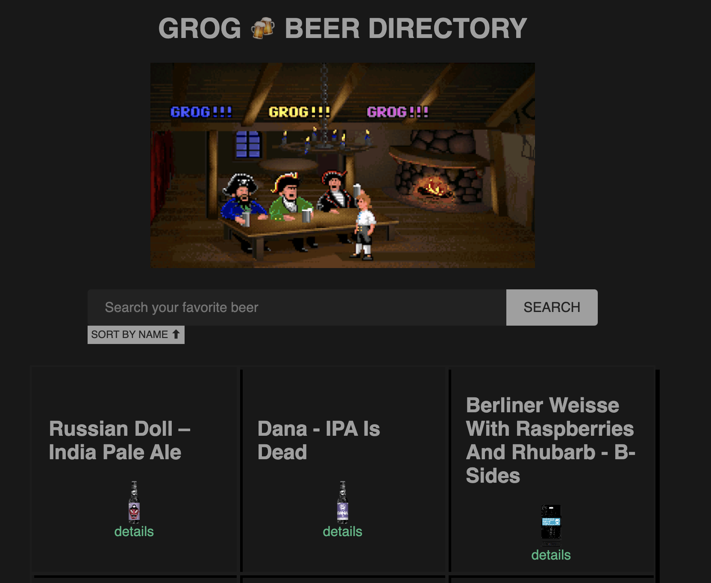
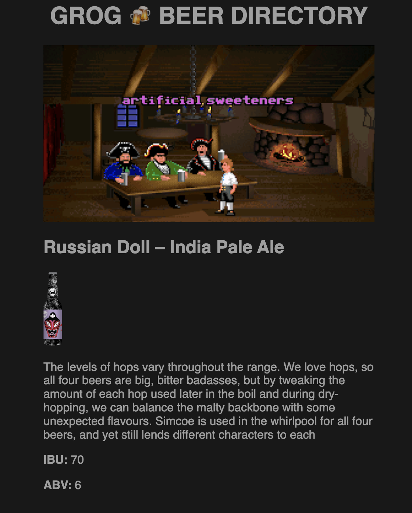

## Get GROG APP running 🍻

This web app is using the last [VUEJS](https://vuejs.org/) version 3.2.37.

To get information about beers grogs consumes data from the open api [punkapi.com](https://punkapi.com/documentation/v2) 

To see improvements, ideas or comments please follow this link [EXTRAS](./EXTRAS.md)


### Running dev version

You'll have the app running in the port 4173 [http://localhost:4173](http://localhost:4173)

```
npm install
npm run dev
```
___
### Running PROD version using Docker

In this case the docker versiuon will server the app using an ngnix instance after the building process.

```
docker-compose up -d 
```

That's it! you have your own GROG app running on [http://localhost:8080](http://localhost:8080)


**Note**: this app was made using NodeJS version 16.16.0.


# Screenhots 📷

## Home page

____

## Beer details
